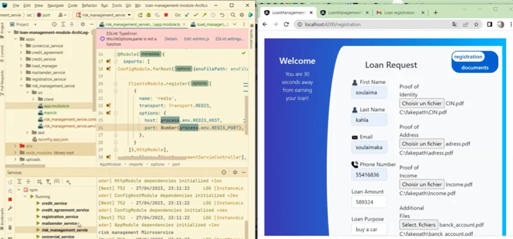

# LoanManagementWeb

This project was generated with [Angular CLI](https://github.com/angular/angular-cli) version 14.1.3.

## Development server

Run `ng serve` for a dev server. Navigate to `http://localhost:4200/`.

## DEMO
)

## Backend
> **_NOTE:_**  this is the frontend of the actual project where you can find the backend through [this link]([https://github.com/SoulaimakH/loan-management-frontend](https://github.com/SoulaimakH/loan-management-module-ArchLog-)https://github.com/SoulaimakH/loan-management-module-ArchLog-)

